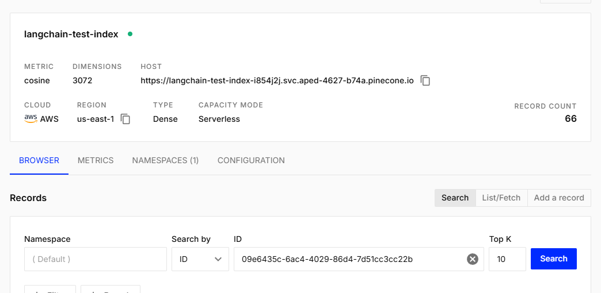
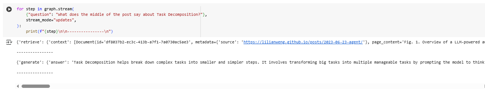

# LLM wit OpenAI

In this project, we are integrating the OpenAI API and providing it with specific context to enable the language model (LLM) to make predictions based on the particular information you provide.

## Getting Started

To get started with this project, we will be using Python 3 and the following dependencies:

```bash
pip install openai

pip install -qU langchain-pinecone pinecone-notebooks

pip install -qU langchain-openai

pip install --quiet --upgrade langchain-text-splitters langchain-community langgraph

pip install -qU langchain-core
```
Additionally, you can open and run the provided Google Colab notebook for easy setup and execution:

Additionally, you can open and run the provided Google Colab notebook for easy setup and execution:

[Open the Colab notebook](https://colab.research.google.com/drive/1U9VIQlsKt-EzSap12xb6iaE203YJHJp_)

---

### Prerequisites

Before you begin, make sure you have the following prerequisites:

- Python 3.x installed on your machine.
- A valid [OpenAI API key](https://beta.openai.com/signup/) to interact with the models.
- A [Pinecone account](https://www.pinecone.io/start/). You'll need to create an index in Pinecone for storing data.
- A [LangSmith APi key](https://docs.smith.langchain.com/).

### Installing
Clone this repository to your local machine:
```
git clone https://github.com/MateoSebF/LLM_WITH_OPENAI.git
cd LLM_WITH_OPENAI
```

Install the required dependencies


### Architecture
To understand the architecture presented in this article, we will use the following diagram:


In this architecture, we leverage the ability to provide additional context to an LLM. The process consists of four steps:

1. Loading the documents: We retrieve the documents that will be used.
2. Splitting the documents: We divide the documents into smaller, more manageable chunks for the LLM.
3. Embedding: We tokenize the documents and transform their content into a more understandable format.
4. Storing embeddings: Once tokenized, we store the embeddings using Pinecone.


### Demo Demostration 



## Built With

* [Java](https://www.oracle.com/co/java/technologies/downloads/) - The programming language used
* [Maven](https://maven.apache.org/) - Dependency Management
* [JUnit](https://junit.org/junit5/) - Testing Framework for unit tests

## Versioning

We use [Conventional Commits](https://www.conventionalcommits.org/en/v1.0.0/) for versioning.  

## Authors

**Mateo Forero** - *Initial work* - [MateoSebF](https://github.com/MateoSebF)

## Acknowledgments

* Inspiration from various resources and tutorials